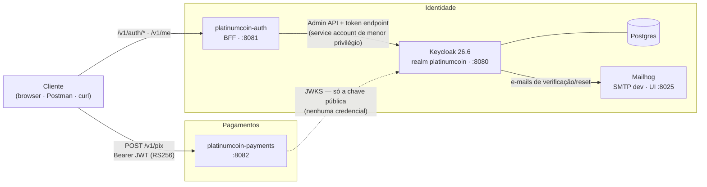

# PlatinumCoin — Identidade & Pagamentos (Pix)

[](https://openjdk.org/projects/jdk/21/)
[](https://spring.io/projects/spring-boot)
[](https://www.keycloak.org/)
[](https://developer.hashicorp.com/terraform)
[](LICENSE)

Serviço de identidade/autenticação de uma fintech de pagamentos instantâneos (Pix) — projeto de
portfólio. **Tese em uma frase:** um IdP real (**Keycloak**) emite **JWT RS256** com um claim
`accountId`; serviços downstream **confiam sem poder emitir** — validam via **JWKS**, exigem o
`aud` deles e **debitam o `accountId` do token, nunca do corpo**.

📍 Roadmap em [`PLAN.md`](PLAN.md) · critérios de aceite em [`docs/dod.md`](docs/dod.md) ·
decisões registradas em [`docs/adr/`](docs/adr/).

## Sumário

- [Arquitetura](#arquitetura)
- [Subir o ambiente](#subir-o-ambiente)
- [Endpoints](#endpoints-v1)
- [E2E entre os serviços (a tese na prática)](#e2e-entre-os-serviços-a-tese-na-prática)
- [RBAC: customer vs. support](#rbac-customer-vs-support)
- [Conta: verificação de e-mail e senhas](#conta-verificação-de-e-mail-e-senhas)
- [Idempotência no Pix + demo](#idempotência-no-pix--harness-de-demonstração)
- [Ciclo de sessão e TTLs](#ciclo-de-sessão-e-ttls)
- [Decisões de arquitetura (ADRs)](#decisões-de-arquitetura-adrs)
- [Notas de desenvolvimento](#notas-de-desenvolvimento)

## Arquitetura



| Serviço | Pasta | Porta | Papel |
|---|---|---|---|
| `platinumcoin-auth` | `/` (raiz) | 8081 | Fachada/BFF sobre o Keycloak: `/v1/auth/*`, `/v1/me` |
| `platinumcoin-payments` | `downstream/payments` | 8082 | Consumidor: `POST /v1/pix`, valida token via JWKS |
| Keycloak (IdP) | Docker | 8080 | Emite os tokens; realm `platinumcoin` provisionado via Terraform |
| Postgres | Docker | 5432 | Persistência do Keycloak |
| Mailhog (SMTP dev) | Docker | 1025/8025 | Recebe e-mails de verificação/reset; UI em 8025 |

O `payments` **não tem credencial nenhuma do Keycloak** — a confiança dele cabe em duas URLs
públicas (`issuer-uri` + `jwk-set-uri`). É a assimetria da tese, visível na config (ADR-005/007).
Cada serviço é um build Maven independente, **sem common-lib** (duplicação proposital — ADR-007),
com layout `api / domain / infra`, erros **RFC 7807** e log JSON com `correlationId` propagado
via `X-Correlation-Id`.

## Subir o ambiente

Pré-requisitos: Docker + Docker Compose, Terraform, JDK 21, Maven.

```bash
docker-compose up -d                          # Keycloak 26.6 (8080) + Postgres + Mailhog (UI 8025)
(cd terraform && terraform init && terraform apply)   # realm platinumcoin
mvn spring-boot:run                           # auth-service na 8081
(cd downstream/payments && mvn spring-boot:run)       # payments na 8082
```

## Endpoints (`/v1`)

| Endpoint | Serviço | O quê |
|---|---|---|
| `POST /v1/auth/register` | auth | Cria usuário via Admin API (service account de menor privilégio); gera `accountId` |
| `POST /v1/auth/login` | auth | Direct grant (harness) → access + refresh |
| `POST /v1/auth/refresh` | auth | Troca refresh por novo par (rotação ativa) |
| `POST /v1/auth/logout` | auth | Revoga a sessão no IdP |
| `GET /v1/me` | auth | Identidade extraída do token (RS256 via JWKS) |
| `POST /v1/auth/verify-email` | auth | (Re)envia o e-mail de verificação; 202 sempre (anti-enumeração) |
| `POST /v1/auth/forgot-password` | auth | E-mail de reset (ação nativa `UPDATE_PASSWORD` do Keycloak); 202 sempre |
| `POST /v1/auth/change-password` | auth | Autenticado; re-autentica com a senha atual e revoga as sessões |
| `POST /v1/pix` | payments | Exige role `customer` + `aud` do payments; **debita o `accountId` do token**; aceita `Idempotency-Key` |
| `GET /v1/admin/receipts` | payments | Exige role `support`; visão de atendimento dos comprovantes (POC: em memória) |

## E2E entre os serviços (a tese na prática)

```bash
CID="e2e-$(date +%s)"

# login no auth → access token (com accountId, roles e aud do payments)
ACCESS=$(curl -s -X POST localhost:8081/v1/auth/login -H 'Content-Type: application/json' \
  -H "X-Correlation-Id: $CID" \
  -d '{"email":"alice@platinumcoin.dev","password":"Seed@12345"}' | jq -r .accessToken)

# Pix no payments com o mesmo correlationId → comprovante com o accountId DO TOKEN
curl -s -X POST localhost:8082/v1/pix -H "Authorization: Bearer $ACCESS" \
  -H 'Content-Type: application/json' -H "X-Correlation-Id: $CID" \
  -d '{"pixKey":"bob@banco.dev","amount":42.50}' | jq

# regra de ouro: accountId divergente no corpo → 422 ACCOUNT_MISMATCH
curl -si -X POST localhost:8082/v1/pix -H "Authorization: Bearer $ACCESS" \
  -H 'Content-Type: application/json' \
  -d '{"pixKey":"bob@banco.dev","amount":42.50,"accountId":"00000000-0000-0000-0000-000000000000"}'

# sem token → 401 problem+json; o mesmo $CID aparece nos logs JSON dos DOIS serviços
curl -si -X POST localhost:8082/v1/pix -H 'Content-Type: application/json' \
  -d '{"pixKey":"bob@banco.dev","amount":1}'
```

## RBAC: customer vs. support

Autorização por realm role, resolvida estruturalmente no `SecurityConfig` (não por `if` no
handler): `/v1/pix` exige `customer`, `/v1/admin/**` exige `support`. Token **válido** com a
role errada → **403** (`ACCESS_DENIED`); token inválido/ausente/aud errado continua **401**.

```bash
# carol tem a role support (seed do Terraform) — autentica, mas não envia Pix
SUPPORT=$(curl -s -X POST localhost:8081/v1/auth/login -H 'Content-Type: application/json' \
  -d '{"email":"carol@platinumcoin.dev","password":"Seed@12345"}' | jq -r .accessToken)

curl -si -X POST localhost:8082/v1/pix -H "Authorization: Bearer $SUPPORT" \
  -H 'Content-Type: application/json' -d '{"pixKey":"bob@banco.dev","amount":1}'   # → 403

curl -s localhost:8082/v1/admin/receipts -H "Authorization: Bearer $SUPPORT" | jq  # → 200

curl -si localhost:8082/v1/admin/receipts -H "Authorization: Bearer $ACCESS"       # customer → 403
```

## Conta: verificação de e-mail e senhas

E-mails saem pelo **Mailhog** (`docker-compose`, UI em <http://localhost:8025>) — nada sai da
máquina. O cadastro nasce não-verificado e dispara a verificação; reset conclui **na página do
Keycloak** via action token do e-mail — o BFF nunca vê a senha nova (ADR-009).

```bash
# cadastro → e-mail de verificação chega no Mailhog (localhost:8025)
curl -s -X POST localhost:8081/v1/auth/register -H 'Content-Type: application/json' \
  -d '{"email":"novo@platinumcoin.dev","password":"S3nh@forte123","fullName":"Novo Cliente","cpf":"529.982.247-25"}' | jq

# reenvio da verificação (202 sempre, exista o e-mail ou não)
curl -si -X POST localhost:8081/v1/auth/verify-email -H 'Content-Type: application/json' \
  -d '{"email":"novo@platinumcoin.dev"}'

# esqueci a senha → e-mail "Update Your Account"; o link conclui o reset no Keycloak
curl -si -X POST localhost:8081/v1/auth/forgot-password -H 'Content-Type: application/json' \
  -d '{"email":"novo@platinumcoin.dev"}'

# troca de senha autenticada: exige token E senha atual; revoga as outras sessões
TOKEN=$(curl -s -X POST localhost:8081/v1/auth/login -H 'Content-Type: application/json' \
  -d '{"email":"novo@platinumcoin.dev","password":"S3nh@forte123"}' | jq -r .accessToken)
curl -si -X POST localhost:8081/v1/auth/change-password -H "Authorization: Bearer $TOKEN" \
  -H 'Content-Type: application/json' \
  -d '{"currentPassword":"S3nh@forte123","newPassword":"N0v@senha456"}'   # → 204
```

## Idempotência no Pix + harness de demonstração

Retry por timeout não pode debitar duas vezes: o cliente manda um **`Idempotency-Key`** (UUID
por operação) e o payments deduplica **por conta do token**, com TTL de 10 min (in-memory —
POC; ver ADR-010). Mesma key + mesmo payload → **mesma resposta, um débito só**; mesma key +
payload diferente → **409 `IDEMPOTENCY_CONFLICT`**; sem key → sem dedup (opt-in).

```bash
KEY=$(uuidgen)

# primeira tentativa → 201 com o comprovante
curl -s -X POST localhost:8082/v1/pix -H "Authorization: Bearer $ACCESS" \
  -H "Idempotency-Key: $KEY" -H 'Content-Type: application/json' \
  -d '{"pixKey":"bob@banco.dev","amount":42.50}' | jq

# "timeout" do cliente: reenvio com a MESMA key → mesmo id, sem segundo débito
curl -s -X POST localhost:8082/v1/pix -H "Authorization: Bearer $ACCESS" \
  -H "Idempotency-Key: $KEY" -H 'Content-Type: application/json' \
  -d '{"pixKey":"bob@banco.dev","amount":42.50}' | jq .id

# reuso indevido: mesma key, payload diferente → 409 IDEMPOTENCY_CONFLICT
curl -si -X POST localhost:8082/v1/pix -H "Authorization: Bearer $ACCESS" \
  -H "Idempotency-Key: $KEY" -H 'Content-Type: application/json' \
  -d '{"pixKey":"bob@banco.dev","amount":99.99}'
```

**Demo no browser:** com os dois serviços de pé, abra <http://localhost:8081> — a página
estática percorre a jornada inteira (login → claims do token → Pix → replay idempotente →
regra de ouro → RBAC), mostrando cada request/resposta e o `correlationId` da jornada. O
payments libera CORS **só** para essa origem de dev.

**Postman:** importe [`docs/postman/platinumcoin.postman_collection.json`](docs/postman/platinumcoin.postman_collection.json)
e rode a pasta *1 · Jornada E2E* em ordem (o login guarda os tokens nas variáveis da coleção);
as pastas seguintes cobrem os fluxos de conta e os testes negativos de confiança, com asserts.

## Ciclo de sessão e TTLs

- **Access token: 5 min.** A validação por JWKS é offline — não existe revogação imediata de um
  access token já emitido. O TTL curto **é** o mecanismo de contenção: comprometeu, vale no máximo
  5 minutos. É o trade-off consciente de não usar introspection (ver ADR-005, Fatia 3).
- **Refresh token: 30 min de inatividade, teto de 10 h** (sessão SSO do realm). Quem usa a conta
  continuamente renova sem re-login; sessão abandonada morre em 30 min.
- **Rotação de refresh com detecção de reuso** (`revoke_refresh_token`, `max_reuse = 0`): cada
  refresh emite um token novo e invalida o anterior. Um refresh token **vazado e reusado** derruba
  a sessão — o ladrão e a vítima ficam com tokens inválidos, e o dano pára no TTL do access.
- **Logout revoga a sessão** no Keycloak: refresh subsequente falha na hora. Access tokens já
  emitidos permanecem válidos até expirar (consequência stateless aceita e documentada).

## Decisões de arquitetura (ADRs)

Cada decisão de peso tem um registro leve em [`docs/adr/`](docs/adr/), escrito dentro da fatia a
que pertence:

| ADR | Decisão |
|---|---|
| [ADR-002](docs/adr/ADR-002-rs256-jwks.md) | RS256 + validação via JWKS (sem segredo compartilhado) |
| [ADR-003](docs/adr/ADR-003-accountid-source-of-truth.md) | `accountId` como user attribute no Keycloak; auth-service stateless |
| [ADR-005](docs/adr/ADR-005-jwks-local-vs-introspection.md) | JWKS local no consumidor; introspection documentada como alternativa |
| [ADR-006](docs/adr/ADR-006-audience-validation.md) | Validação de `aud` — nenhum serviço aceita token de outra audiência |
| [ADR-007](docs/adr/ADR-007-no-common-lib.md) | Sem common-lib; duplicação proposital da config de resource server |
| [ADR-009](docs/adr/ADR-009-fluxos-de-credencial-nativos.md) | Fluxos de credencial pelas ações nativas do Keycloak (BFF nunca vê a senha) |
| [ADR-010](docs/adr/ADR-010-idempotencia-pix.md) | Idempotência do Pix por `Idempotency-Key`, escopo por conta, TTL |

## Contribuindo & licença

Diretrizes de contribuição em [`CONTRIBUTING.md`](CONTRIBUTING.md) e política de segurança em
[`SECURITY.md`](SECURITY.md). Distribuído sob a licença [MIT](LICENSE).

## Notas de desenvolvimento

Este projeto foi construído em pair programming com o **Claude Code (modelo Fable)**, seguindo o
processo descrito no [`PLAN.md`](PLAN.md): uma fatia vertical por vez, o
[DoD](docs/dod.md) como portão de conclusão e ADR quando a decisão pesa. Como retrospectiva de
tooling, fica o balanço da experiência — 6 fatias entregues (IdP provisionado por Terraform,
dois serviços Spring Boot, testes, coleção Postman e demo em browser) em ~3 dias de calendário,
com custo total de créditos de **R$ 265,44** (~R$ 44 por fatia de ponta a ponta):

| Categoria | Nota | Comentário |
|---|:---:|---|
| Velocidade de entrega | 5/5 | Cada fatia saiu em uma sessão: infra, código, verificação via curl e docs no mesmo ciclo. O gargalo passou a ser revisar, não produzir. |
| Custo-benefício | 5/5 | R$ 265,44 pelo projeto inteiro — menos que uma hora de consultoria por um sistema demonstrável com IdP real e dois serviços. |
| Retrabalho exigido | 4/5 | Quase nada foi jogado fora, mas os gotchas do Keycloak 26 (user profile declarativo, mapper sem `Add to access token`, realm-export sem client scopes built-in) custaram iterações de diagnóstico. |
| Aderência ao plano | 4/5 | Disciplina alta com as fatias e o DoD; houve um replanejamento no meio (MFA saiu do escopo da Fatia 6) — decisão de produto, mas exigiu realinhar plano e docs. |
| Qualidade final | 4/5 | Arquitetura consistente (api/domain/infra, RFC 7807, correlationId, ADRs), com limites assumidos de POC: idempotência e comprovantes em memória. |

O maior ganho não foi digitar menos: foi manter **ritmo de decisão** — cada trade-off (JWKS vs.
introspection, TTLs, sem common-lib) foi discutido, decidido e registrado na hora em vez de
adiado.
